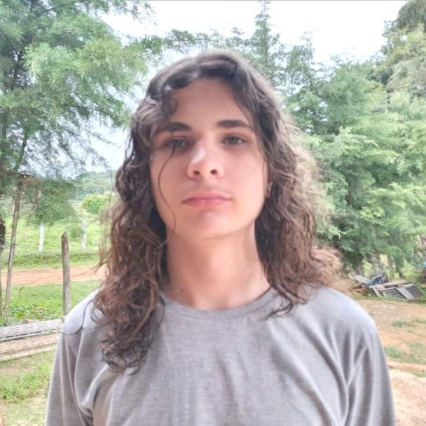
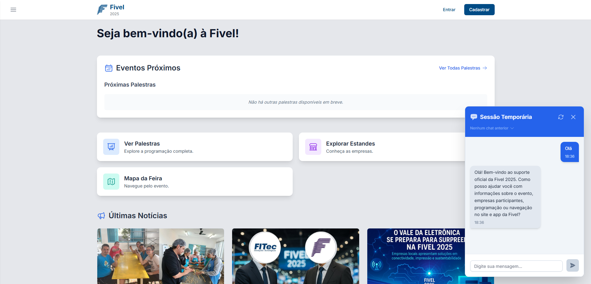

<!--
Este README aparece no seu perfil do GitHub quando está no repositório
<seu-usuario>/<seu-usuario>. Substitua os caminhos das imagens conforme indicado.
-->

<h1 align="center">Olá, eu sou o Frederico Andrade 👋</h1>

  Desenvolvedor Full Stack • Empreendedor • Sempre aprendendo e construindo

---

## 👤 Sobre mim

  <!-- Substitua pelo arquivo da sua foto (ex.: ./assets/perfil.jpg) -->
  

- Comecei na programação como passatempo aos 11 anos e nunca mais parei.
- Premiações em olimpíadas de programação (**OBI** e **OLIP**) e participação em olimpíadas de matemática (**OBMEP** e **Canguru de Matemática**).
- Enxadrista: campeão do torneio interno do **IFSULDEMINAS – Campus Inconfidentes** e de um torneio no Sul de Minas.
- **Valores**: confiança no trabalho e busca pela **independência do indivíduo**.
- **Desenvolvedor Full Stack independente**, sempre explorando novas tecnologias para aprimorar minhas habilidades.

---

## 🚀 Projeto recente — app.fivel.com.br

<a href="https://app.fivel.com.br" target="_blank">
  <!-- Coloque um print do projeto: ex.: ./assets/fivel-screenshot.png -->
  
</a>

**Papel:** Desenvolvimento Full Stack como integrante da **NaHub**  
**Stack:** **MySQL**, **Node.js**, **Express**, **React**, **Tailwind CSS**

**Destaques técnicos:**
- APIs REST organizadas por domínios e padronizadas;
- Camadas separadas (serviços, repositórios, validações) e integração com MySQL;
- Interface responsiva com Tailwind e componentes reutilizáveis em React;
- Boas práticas de versionamento e automação básica de rotinas.

---

## 🧰 Stack & Ferramentas

  
  
  
  
  
  
  

---

## 🏆 Conquistas & Interesses

- 🥇 OBI e OLIP (programação) • 📐 OBMEP e Canguru (matemática)  
- ♟️ Xadrez competitivo (IFSULDEMINAS e torneio regional)  
- 🔭 Interesses: arquitetura de software, performance de APIs, automação de processos e UX focada em clareza.

---

## 📌 Como usar as imagens deste README

- **Foto pessoal:** salve sua imagem em `./assets/perfil.jpg` (ou ajuste o caminho em “Sobre mim”).  
- **Print do projeto:** salve em `./assets/fivel-screenshot.png` (ou ajuste o caminho na seção do projeto).

---

<!-- Opcional: ative depois de trocar "seu-usuario" pelo seu @ do GitHub
## 📊 Atividade

  
  

-->

